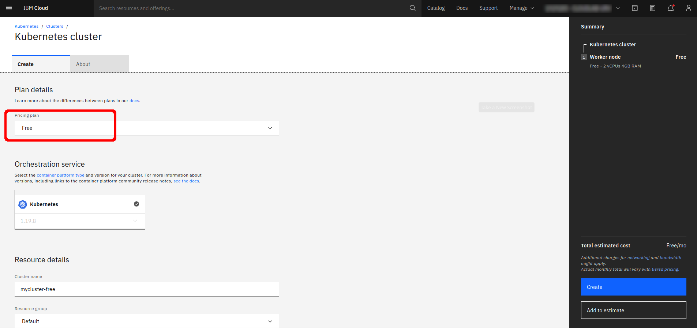
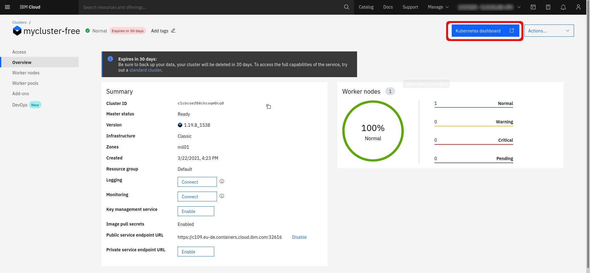
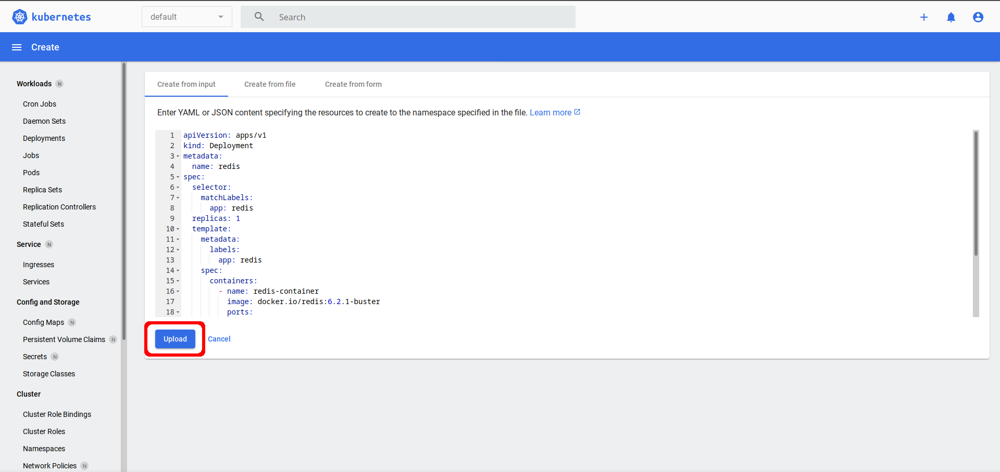
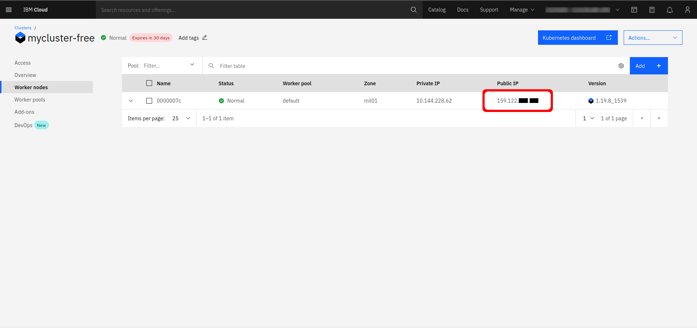

# Setup external services on a free IBM Cloud account

This guide provides steps to setup the external services required by Triggerflow on a free IBM Cloud account.

We will use IBM Cloud Managed Kubernetes Service to create a free cluster and services for Redis and RabbitMQ. Those services will be accessible through internet using a public IP, so we can orchestrate serverless functions using a local triggerflow deployment (We could also deploy Triggerflow on the Kubernetes cluster).

Note that this setup is only advised for development and testing purposes.

1. **Create an IBM Cloud account**: If you belong to an academic institution, you might be elegible for a IBM Cloud Academic Initiative account. Check out it [here](https://www.ibm.com/academic/home).
2. **Create a FREE Kubernetes cluster using IBM Cloud Managed Kubernetes Service**: Navigate to https://cloud.ibm.com/kubernetes/overview and create a free cluster. Wait until the worker and master nodes are up.
    
3. **Open Kubernetes administration UI app**:
    
4. **Create the Redis and RabbitMQ services**: Click on the `+` button at the top left corner of the window. Copy and paste the Kubernetes deployment and serivce manifesto listed below and then click *Upload*.
    ```yaml
    apiVersion: apps/v1
    kind: Deployment
    metadata:
      name: redis
    spec:
      selector:
        matchLabels:
          app: redis
      replicas: 1
      template:
        metadata:
          labels:
            app: redis
        spec:
          containers:
            - name: redis-container
              image: docker.io/redis:6.2.1-buster
              ports:
                - containerPort: 6379
              command: ["redis-server"]
              args: ["--requirepass", "$(REDISPASSWORD)"]
              env:
                - name: REDISPASSWORD
                  value: changeme
    ---
    apiVersion: apps/v1
    kind: Deployment
    metadata:
      name: rabbitmq
    spec:
      selector:
        matchLabels:
          app: rabbitmq
      replicas: 1
      template:
        metadata:
          labels:
            app: rabbitmq
        spec:
          containers:
            - name: rabbitmq-container
              image: docker.io/rabbitmq:3.8.14-management
              ports:
                - name: amqp
                  containerPort: 5672
                - name: managemet
                  containerPort: 15672
    ---
    apiVersion: v1
    kind: Service
    metadata:
      name: redis
    spec:
      type: NodePort
      ports:
      - protocol: TCP
        port: 6379
        targetPort: 6379
        nodePort: 30000
      selector:
        app: redis
    ---
    apiVersion: v1
    kind: Service
    metadata:
      name: rabbitmq-service
    spec:
      type: NodePort
      ports:
      - name: amqp
        protocol: TCP
        port: 5672
        targetPort: 5672
        nodePort: 30001
      - name: management
        protocol: TCP
        port: 15672
        targetPort: 15672
        nodePort: 30002
      selector:
        app: rabbitmq
    ```
    Note that Redis will be accessible on port `30000` and RabbitMQ AMQP and RabbitMQ management on ports `30001` and `30002` respectively. Also the Redis password is set as `changeme`. You may change this values at will.
    
5. **Check the services**: Wait until all pods and services are up. Navigate to IBM Cloud Kubernetes console and select your cluster. Change to the *Worker nodes* tab on the left. There will be listed the worker node of your cluster. Get the public IP of the node:
    
    You can now access the services using this IP. For example, RabbitMQ management is at port 30002, you can access the RabbitMQ management using a browser to quickly check if it is accessible. 


